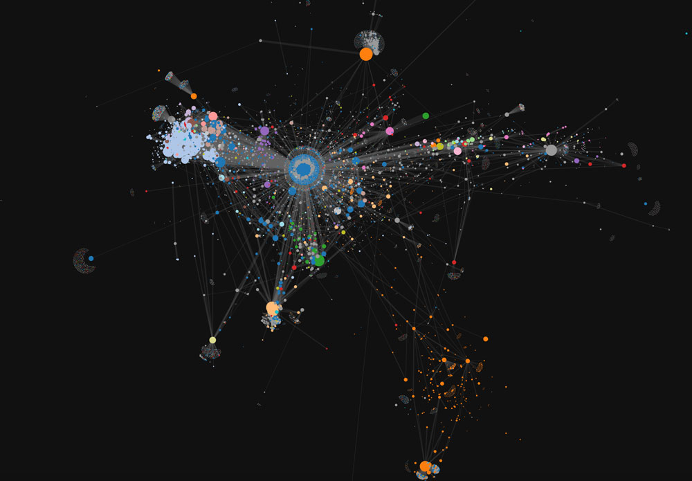

# 希拉里邮件门数据

很难想象，2016年大选，几个黑客改变了世界上最强国家的命运
作为一个工科男，学习英语 && 政治 && 数据库&&数据可视化，当推[维基解密](https://wikileaks.org/)

### [希拉里邮件](https://wikileaks.org/clinton-emails/)

| 总数     | 本人发送  | 发布时间       | 时间跨度               |      |      |
| :----- | ----- | ---------- | ------------------ | ---- | ---- |
| 30322封 | 7570封 | 2016-03-16 | 2010-06 => 2014-08 |      |      |
#### 概要

#### 相关数据
[希拉里邮件收集 dump](https://github.com/datahoarder/secretary-clinton-email-dump)
[希拉里邮件中人名的对应关系](https://github.com/wsjdata/clinton-email-cruncher/blob/master/HRCEMAIL_names.csv)

### [Podesta邮件](https://wikileaks.org/podesta-emails/)

| 总数      | 发布时间       | 时间跨度         |
| :------ | ---------- | ------------ |
| 超58000封 | 2016年10月7日 | 1998 => 2001 |

#### 概要

#### 涉及人物
Podesta是Clintons的长期合伙人
1998年-2001年任比尔·克林顿的参谋长
Podesta先生还与其兄弟Tony拥有Podesta集团

### [民主党全国委员会（dnc）邮件](https://wikileaks.org/dnc-emails/)

| 总数     | 附件数  | 发布时间       | 时间跨度               |
| :----- | ---- | ---------- | ------------------ |
| 19252封 | 8034 | 2016-07-22 | 2015 => 2016-05-25 |

#### 概要
DNC （Democratic National Committee ）民主党全国委员会

#### 涉及人物
通讯总监 Luis Miranda（10770封）
国家财政总监 Jordon Kaplan（3797封）
财务总监 Scott Comer（3095封）
金融数据与战略总监 Daniel Parrish（1472封）
财务总监 Allen Zachary（1611封）
高级顾问 Andrew Wright（938封）
北加州财务总监 Robert（Erik）Stowe（751封）

### 相关讨论

[希拉理竞选部主席Podesta的私信总结 CN](http://www.3456287.com/minghua-2-22798-0.html)
[知乎讨论帖 CN](https://www.zhihu.com/question/51362588/answer/126195464)
[希拉里·克林顿电子邮件争议 WIKI CN](https://zh.wikipedia.org/wiki/%E5%B8%8C%E6%8B%89%E9%87%8C%C2%B7%E5%85%8B%E6%9E%97%E9%A1%BF%E7%94%B5%E5%AD%90%E9%82%AE%E4%BB%B6%E4%BA%89%E8%AE%AE)

[知乎：邮件门最新进展–FBI刺刀上膛 CN](https://www.letscorp.net/archives/111981)
[希拉里邮件分析 EN](http://www.vaskal.ca/podestafiles)

#### 暗杀事件

死亡名单:

| 中文名     | 英文名              | 组织/职务                 | 死亡日期       | 其他   |
| :------ | ---------------- | --------------------- | ---------- | ---- |
|         | Seth Conrad Rich | DNC                   |            |      |
| 肖恩·卢卡斯  | Shawn Lucas      | 民主党全国委员会(DNC)欺诈的主控律师  | 2016年8月2号  |      |
| 维克多·托尔恩 | Victor Thorn     | 美国调查记者和作家             | 2016年8月    |      |
| 弗林      |                  | 美国保守派网站《布赖特巴特新闻》编辑    | 6月28日      |      |
| 康拉德·里奇  |                  | 民主党 希拉里的法律合伙人         | 2015年7月10日 |      |
|         | Vince Foster     | 法律事务所                 |            |      |
|         | Shawn Lucas      | 传票送达员                 |            |      |
|         | Seth Conrad Rich | 27岁的民主党职员             |            |      |
|         | Mike Flynn       | Breitbart News网站的新闻编辑 | 2016年6月23日 |      |
|         | John Ashe        | 联合国前官员                | 2016年6月22日 |      |

[美媒：神秘死亡的美民主党员或是“邮件门”泄密者](http://news.xinhuanet.com/world/2016-08/11/c_129220675.htm)
[希拉里邮件门爆料人被暗杀，6星期内5位希拉里黑幕知情者离奇死亡--美国政治之恐怖远超你想象](http://www.cwzg.cn/html/2016/guanfengchasu_0810/30107.html)

[如何看待2016年10月14日最新维基解密，美国最高法院已故大法官斯卡利亚死因疑似为遭谋杀？](https://www.zhihu.com/question/51576593?rf=51560744)
[希拉里谋杀Scalia跟进：另一封邮件是交易合同](https://zhuanlan.zhihu.com/p/22987931)

[年度悬疑——希拉里团队真的谋杀了大法官？](http://posts.careerengine.us/p/580da1a4e51c464b93405ea0)

#### 希拉里邮件片段
参考如下：
[希拉里邮件内容](http://www.jiemian.com/article/240575.html)

　　“收钱”希拉里团队的几乎所有高层讨论是否接受外国政府掮客的政治献金（这是违反联邦竞选法律的）。最后伴随着Jen Palmeri的一句“收钱”，希拉里团队决定接受代表外国政府势力的政治献金。

　　希拉里疑似在参加2015年12月的初选辩论之前就拿到主持人将问的所有问题。

　　赫芬顿邮报记者Brent Budowsky写信给Podesta为自己的文章"The Magic of Bill Clinton"邀功。Podesta的回复只是一个字"Yep"（Brent Budowsky真是一条好狗）。

　　赫芬顿邮报记者Brent Budowsky自告奋勇去伪装出一种支持桑德斯的立场，这样桑德斯败选后，更有利于他去说服桑德斯支持者出来投希拉里的票 （再次证明Brent Budowsky是忠犬一条）。

　　Podesta跟CTR沟通选战事宜（违反FECA）。

　　Podesta收到HWJ Foundation（致力于医保改革）支付的顾问报酬。（Conflict of interests）

　　讨论怎么控制左派新闻媒体的言论。

　　希拉里团队担心桑德斯支持者和年轻女性党员太憎恶希拉里以至于可能会投票给共和党。同时信中的讨论表明希拉里在初选时从建制派得到的支持可能远比想象中小。

　　2008年花旗集团执行官提交给Podesta一份奥巴马政府的内阁成员建议名单（结果显示命中率蛮高的）。

　　洛杉矶时报为希拉里出谋划策写枪文。

　　希拉里团队讨论怎么操纵和利用reddit的言论导向。

　　Podesta希望制造圣伯纳德惨案的枪手是白人而不是穆斯林，建议媒体把抢手的穆斯林姓名“Sayeed Farouk”改成白人姓名“Christopher Hayes”。

　　POLITICO分管政治的主编Glenn Thrush为希拉里团队写枪文。

　　利用财务漏洞来修补赤字。

　　希拉里团队抱怨希拉里经常在公开场合说假话。

　　打算攻击桑德斯写荤段子。
　　希拉里团队讨论私服上邮件的危险性。最后发现希拉里将含有机密信息的邮件提供给了以下人士： Combetta, Pagliano, all of her lawyers, all of Platte River Network maybe a few janitors。

　　希拉里夫妻反对同性婚姻，表面上的支持只是为了选举的伪装。

　　希拉里团队担心纽时曝光他们和PAC的会面（违反选举法）。纽时最后理所当然地没有报道这件事。

　　希拉里团队讨论销毁邮件。

　　希拉里厌恶日常美国人。

　　雅虎记者Katie Couric为希拉里写枪文。

　　CVC（切尔西克林顿）大嘴巴跟朋友讲克林顿基金会内的经济丑闻。

　　讨论怎么在初选辩论日程安排上作弊更有利于希拉里。

　　扔块骨头给桑德斯和他的支持者来减轻他们对败选的不满。

　　希拉里团队讨论怎么避免召开新闻发布会，以免被问起基金会和邮件问题。

　　内部邮件显示希拉里将最终支持TPP。

　　记者Brent Budowsky忧心忡忡地写信给Podesta说要希拉里注意贪污问题。

　　WJC从CICSO拿了25.5万刀演讲费，两个月国务院就投桃报李地还了人情。

　　FBI/DOJ的调查组让他放心，会妥善处理对他的调查，并会向公众保密。

　　如果拉力观众少于100人，希拉里团队会没收手机并禁止媒体参加。

　　希拉里参选过程中，WSJ准备做一场付费演讲。Mook希望取消这场演讲以免影响团队形象，但担心希拉里会舍不得演讲费。

　　被销毁的邮件中疑似包括奥巴马的违法证据。

　　希拉里团队想制造一种她有大量小额捐献者的假象。

　　国务院帮希拉里掩盖私删邮件的罪行

　　美联社记者Julie Pace为了希拉里团队写枪文。

　　在初选开始投票前，某些州，比如新泽西州，就已经做好局让希拉里取胜。

　　如果希拉里败选，奥巴马的损失会很大。

　　希拉里支持化石燃料的使用，嘲笑环保主义反对者。

　　Podesta会见SuperPAC（违反选举法）。

　　疑似讨论暗杀大法官斯科拉的计划。

　　希拉里团队的高级官员John Halpin和Jennifer Palmieri嘲笑天主教和福音教的信徒。还进一步攻击默多克在约旦河（耶稣基督在这条河里受洗）给儿子受洗是件多么悖时落后的行为。
　　
　　
#### Podesta邮件片段

在这封波德斯塔给华盛顿说客Steve Elmendorf的邮件中，波德斯塔写道，“没想到wet works指的是葡萄园的泳池派对。”当天晚上Elmendorf回信称，“我已经全身心投入了。这听上去将会是一个糟糕的夜晚，我们都需要准备随时行动。这封邮件发送的时间是在2016年2月9日，三天后大法官斯卡利亚突然身亡。而去世的前一天晚上，他还在德克萨斯州捕猎鹌鹑并在Cibolo Creek Ranch酒店和客人一起用餐。
引起外界注意的是，邮件中提到的“wet works”是一个情报术语，指公众人物、外交家或者政治人物的暗杀。而斯卡利亚当晚宴请宾客的酒店就恰好有一个葡萄园和泳池。
另外一封邮件显示，在斯卡利亚死亡后不到一天的时间，波德斯塔在邮件中与乔治•索罗斯的亲信讨论斯卡利亚的接替者。